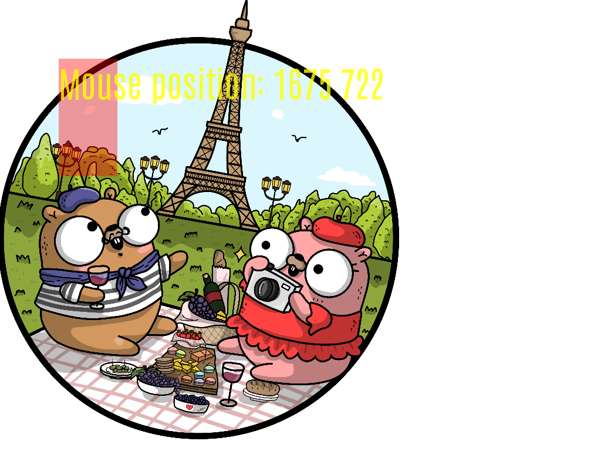

# GopherMedia
c++ wrapper of sdl2

# Tutorial
no tutorial for now, just look at gopher_media.h and use your brain.

# Dependencies
SDL2, Eigen 3, and GLEW

Note that you probably need to update your include/link paths for GopherMedia to compile successfully.

# Screenshots



# Compilation and exection

```
git submodule update --init --recursive
cmake .
make
cd bin
./test2d
./test3d
```

# Contribution

Fork this repo, add some changes there, and make a pull request. Please do changes on the develop branch and don't merge to master. I will merge to master.

# Legal

tests/GO_PARIS.png: by Ashley Mcnamara; © 2018 Ashley Mcnamara; Licensed under CC BY-NC-SA 4.0; https://raw.githubusercontent.com/ashleymcnamara/gophers/master/GO_PARIS.png

GopherMedia is licensed under the MIT License.
